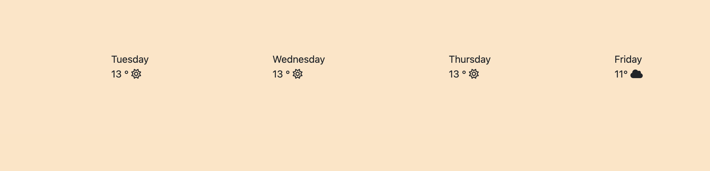
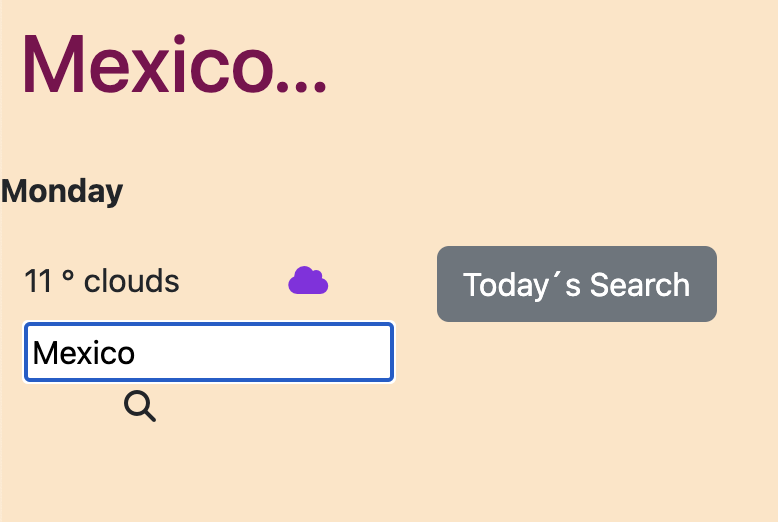

# SheCodes - My First WeatherApp in github

<em> Welcome to My first Project- She Codes Academy</em>

### General Data

**- Project Designer:** Maria Isabel Rico
**- Project Tittle:** Weather App

  
Table of Contents 

  <ol>
  <li><a href="#objetivo-🎯">Objetive</a></li>
  <li><a href="#sobre-el-proyecto-🔎">About the Project</a></li>
  <li><a href="#deploy-🚀">Deploy</a></li>
  <li><a href="#vistas">Views</a></li>
  <li><a href="#licencia">Licence</a></li>
  <li><a href="#contacto">Contact</a></li>
  </ol>

## Objetive🎯

## About the project-🔎

I have used a few div containers, Bootstrap, html, css to create this Responsive and Minimalist Weather App and I have also included some javascript objects like Events. I'm including a README and uploading to production with Github pages.

## Deploy 🚀 🚀

<a href="https://maricode-40.github.io/MyFirst-WeatherApp/"> production URL </a>

## Views

## Licence

This project is under licence of "My Name"

## Contact 👩🏽‍💻

